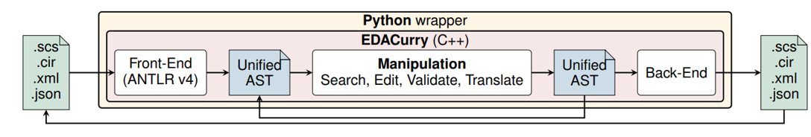
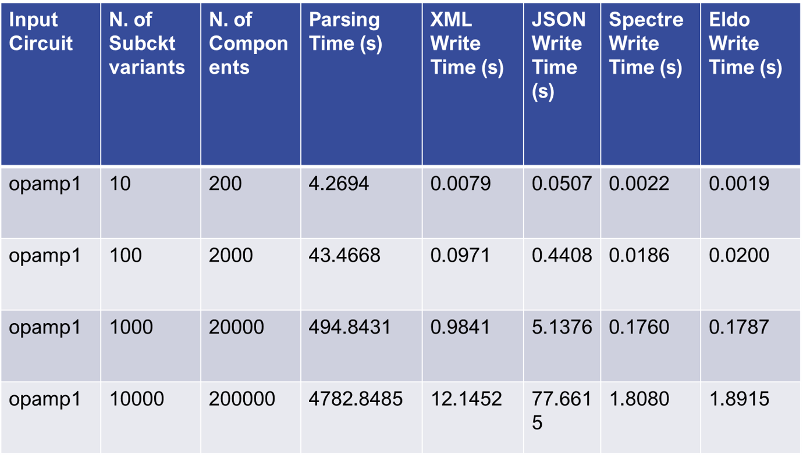
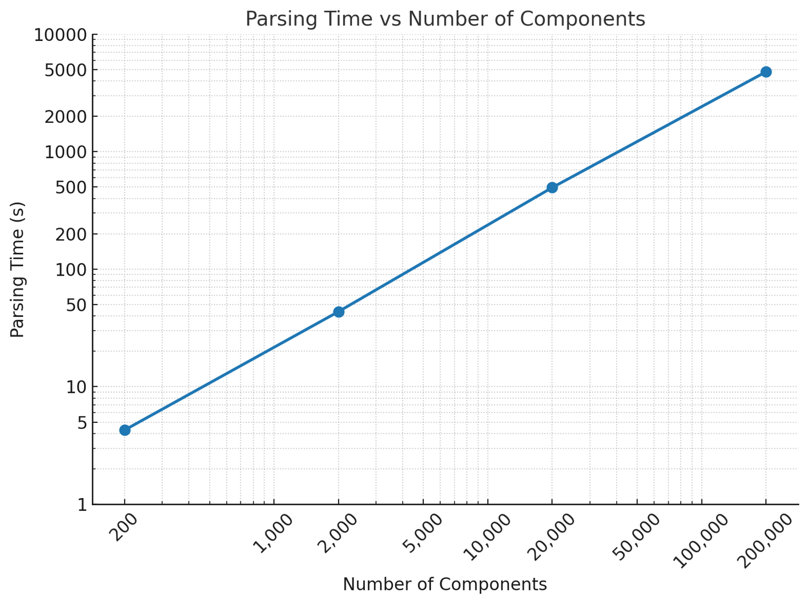
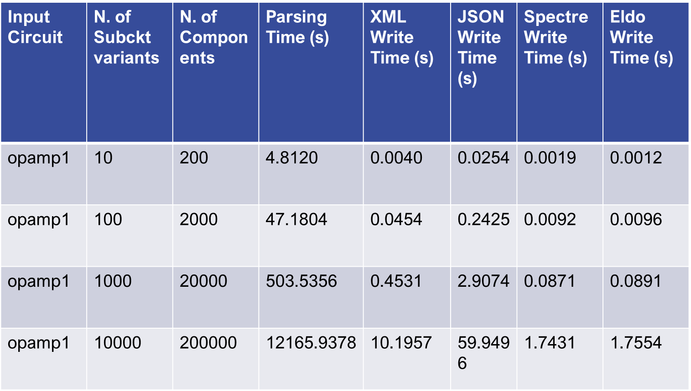
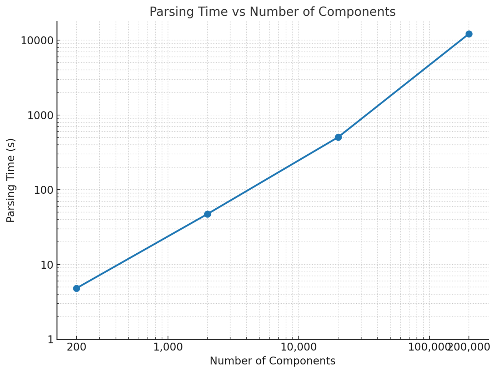

# EDACurry: A Multi-Language Framework to Create, Translate, and Manipulate Transistor-Level Netlists

The Simulation Program with Integrated Circuit Emphasis (SPICE), introduced in 1973, laid the foundation for transistor-level netlist representation. Over the decades, numerous SPICE dialects emerged, each tailored to specific needs but sharing core semantics. This article presents EDACurry, an innovative, open-source framework designed to simplify and automate the creation, translation, and manipulation of transistor-level netlists across SPICE-based languages such as Eldo and Spectre.

By leveraging a unified internal Abstract Syntax Tree (AST),
EDACurry bridges syntactical differences while maintaining
semantic consistency, enabling efficient manipulation workflows.
The framework supports custom operations, including design
space exploration, defect model injection, and subcircuit wrapping, all accessible through Python. Demonstrated applications highlight its versatility in analog design workflows, offering integration with commercial and open-source simulators. With EDACurry, analog designers gain a powerful tool to support netlist manipulation tasks, improving productivity and fostering innovation in circuit design.

## Project Structure and Files

    .
    ├── grammar/                # Spectre and Eldo grammar.
    ├── sources/                # Netlist manipulator (includes C++ parser).
    ├── LICENSE                       
    └── README.md
 
## Scalability Analysis

EDACurry has been tested on large-scale netlists to assess its scalability. The following benchmarks show parsing and writing times for both Eldo and Spectre formats, using up to 200,000 components. Results were obtained on Ubuntu 22.04.5 LTS, Intel Core i7-9700, 32 GB RAM. All the circuits used for scalability tests are available in the repository under [EDACurry/sources/test](sources/test).

**Key findings:**
- Parsing time increases linearly with the number of components, confirming good scalability.
- Per-device cost remains nearly constant, even for the largest cases.
- No exponential growth in processing time was observed.

### Eldo Results

### Spectre Results

**Summary:**
The analysis demonstrates that EDACurry can efficiently handle very large netlists, with linear scaling in parsing and writing operations for both Eldo and Spectre formats. This makes the tool suitable for industrial-scale analog design workflows.
